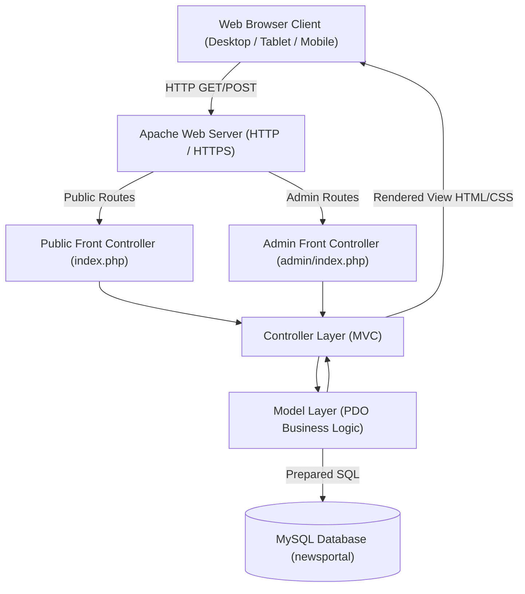
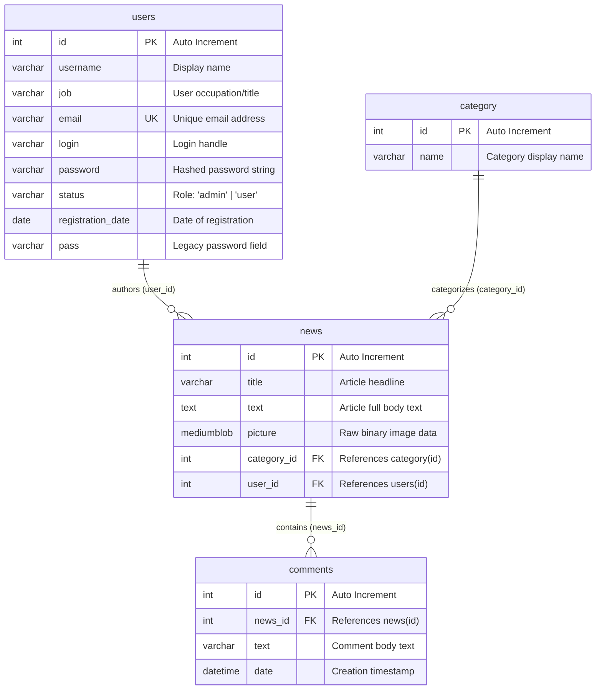

# Software Requirements Specification (SRS) — NewsPortal System

**Document Standard:** ISO/IEC/IEEE 29148:2018 (Systems and software engineering — Life cycle processes — Requirements engineering)  
**System Name:** NewsPortal Application  
**Version:** 1.0.0  
**Status:** Approved / Baseline  
**Date:** 2026-09-11  
**Author / Organization:** Vitali Kolesnikov (IVKHK)  
**Repository:** [https://github.com/Vitali-Kol/news-php.git](https://github.com/Vitali-Kol/news-php.git)

---

## Table of Contents
1. [1. Introduction](#1-introduction)
   - [1.1 Purpose](#11-purpose)
   - [1.2 Scope of the System](#12-scope-of-the-system)
   - [1.3 Product Overview](#13-product-overview)
   - [1.4 Definitions, Acronyms, and Abbreviations](#14-definitions-acronyms-and-abbreviations)
   - [1.5 References](#15-references)
   - [1.6 Document Overview & Conventions](#16-document-overview--conventions)
2. [2. Overall Description](#2-overall-description)
   - [2.1 Product Perspective & Context](#21-product-perspective--context)
   - [2.2 Product Functions Summary](#22-product-functions-summary)
   - [2.3 User Classes and Characteristics (Stakeholders)](#23-user-classes-and-characteristics-stakeholders)
   - [2.4 Operating Environment](#24-operating-environment)
   - [2.5 Design and Implementation Constraints](#25-design-and-implementation-constraints)
   - [2.6 Assumptions and Dependencies](#26-assumptions-and-dependencies)
3. [3. Specific Requirements](#3-specific-requirements)
   - [3.1 External Interface Requirements](#31-external-interface-requirements)
   - [3.2 Functional Requirements](#32-functional-requirements)
     - [3.2.1 Public Portal & Content Browsing](#321-public-portal--content-browsing)
     - [3.2.2 Comment Management System](#322-comment-management-system)
     - [3.2.3 User Authentication & Registration](#323-user-authentication--registration)
     - [3.2.4 Administrative Control Panel & Metrics](#324-administrative-control-panel--metrics)
     - [3.2.5 News Article Lifecycle (CRUD)](#325-news-article-lifecycle-crud)
     - [3.2.6 News Category Lifecycle (CRUD)](#326-news-category-lifecycle-crud)
     - [3.2.7 Administrator Profile & Security](#327-administrator-profile--security)
   - [3.3 Data Model & Data Dictionary](#33-data-model--data-dictionary)
   - [3.4 System Architecture & URL Routing Matrix](#34-system-architecture--url-routing-matrix)
4. [4. Non-Functional & System Quality Requirements](#4-non-functional--system-quality-requirements)
   - [4.1 Performance Requirements](#41-performance-requirements)
   - [4.2 Security & Protection Requirements](#42-security--protection-requirements)
   - [4.3 Reliability & Availability](#43-reliability--availability)
   - [4.4 Maintainability & Modularity](#44-maintainability--modularity)
   - [4.5 Usability & Accessibility](#45-usability--accessibility)
5. [5. Verification, Validation & Traceability (RTM)](#5-verification-validation--traceability-rtm)
   - [5.1 Verification Methods Definition](#51-verification-methods-definition)
   - [5.2 Requirements Traceability Matrix (RTM)](#52-requirements-traceability-matrix-rtm)

---

## 1. Introduction

### 1.1 Purpose
This Software Requirements Specification (SRS) establishes the complete functional, non-functional, data, and quality requirements for the **NewsPortal System** (Release 1.0.0). This document conforms strictly to the requirements formulation guidelines and specification structure outlined in **ISO/IEC/IEEE 29148:2018**.

### 1.2 Scope of the System
The NewsPortal System is a modular web application designed for publishing, reading, categorizing, and discussing dynamic news feeds. The system comprises:
1. **Public Web Portal (`index.php`):** Accessible to anonymous visitors and registered users for content consumption, category filtering, and community commenting.
2. **Administrative Control System (`admin/index.php`):** A protected, authenticated back-office enabling editors and system administrators to manage news items, categories, system metrics, and credentials.

### 1.3 Product Overview
The system follows a strict **Model-View-Controller (MVC)** architectural paradigm in native PHP 8+, utilizing MySQL for relational persistence with binary object (BLOB) image storage, and Bootstrap 5 for responsive presentation.

### 1.4 Definitions, Acronyms, and Abbreviations

| Term / Acronym | Definition |
| :--- | :--- |
| **BLOB** | Binary Large Object; MySQL data type used for storing raw image payloads. |
| **CRUD** | Create, Read, Update, Delete — fundamental persistence operations. |
| **E2E** | End-to-End Testing; functional verification simulating real user workflows. |
| **MVC** | Model-View-Controller; software architectural pattern separating domain logic, routing/controllers, and presentation. |
| **PDO** | PHP Data Objects; database abstraction layer enforcing parameterized queries. |
| **RBAC** | Role-Based Access Control; authorization mechanism based on assigned user status. |
| **RTM** | Requirements Traceability Matrix; cross-referencing requirements to test cases. |
| **SQLi** | SQL Injection; database exploit mitigated by prepared statements. |
| **SRS** | Software Requirements Specification. |
| **XSS** | Cross-Site Scripting; web vulnerability mitigated by HTML entity encoding (`htmlspecialchars`). |

### 1.5 References
1. **ISO/IEC/IEEE 29148:2018:** Systems and software engineering — Life cycle processes — Requirements engineering.
2. **ISO/IEC 25010:2011:** Systems and software Quality Requirements and Evaluation (SQuaRE) — System and software quality models.
3. **PHP Documentation (v8.0+):** PHP Data Objects (PDO) & Secure Password Hashing APIs.
4. **OWASP Top 10 (2021):** Web Application Security Standard Risks and Defenses.

### 1.6 Document Overview & Conventions
In accordance with ISO/IEC/IEEE 29148:2018 normative keyword conventions:
* **"shall"** indicates a mandatory system requirement.
* **"should"** indicates a strongly recommended capability or best practice.
* **"may"** indicates an optional or permitted feature.

Each requirement is uniquely indexed with an identifier: `[SRS-REQ-<MODULE>-<ID>]`.

---

## 2. Overall Description

### 2.1 Product Perspective & Context
NewsPortal operates as an autonomous web application running within an Apache/PHP/MySQL hosting environment (e.g., XAMPP stack).

### 2.2 Product Functions Summary
* **Content Delivery:** Display latest top stories, full catalogs, and category-filtered articles.
* **Interactive Engagement:** Allow public users to submit and view article comments.
* **Identity Management:** Secure user registration, authentication, session state, and role isolation.
* **Content Administration:** Complete administrative dashboard, news CRUD, category CRUD, and metric cards.

### 2.3 User Classes and Characteristics (Stakeholders)

| Stakeholder Role | Access Realm | Profile & Privileges |
| :--- | :--- | :--- |
| **Guest / Anonymous Visitor** | Public Portal | General public. Unauthenticated. Read-only access to published news, categories, comments, and login/register forms. |
| **Registered Member (`status='user'`)** | Public Portal | Verified users. Authenticated session. Can post comments, view personalized header badge, and log out. |
| **Administrator (`status='admin'`)** | Public + Admin Panel | System editors. Authenticated admin session. Full CRUD control over news and categories, analytics dashboard, password/profile updates. |

### 2.4 Operating Environment
* **Server Hardware:** Minimum 1 CPU core, 512 MB RAM, 100 MB disk storage.
* **Server Software:** Apache 2.4+, PHP 8.0 or higher with `pdo_mysql` and `session` extensions enabled.
* **Database Engine:** MySQL 5.7+ or MariaDB 10.4+ with InnoDB engine and `utf8mb4` character set.
* **Client Compatibility:** Modern evergreen web browsers (Google Chrome, Mozilla Firefox, Microsoft Edge, Safari) on Desktop, Tablet, and Mobile.

### 2.5 Design and Implementation Constraints
1. **Architecture:** Pure native PHP implementing MVC without heavy external backend frameworks (e.g., Laravel, Symfony) to maintain ultra-light footprint and educational transparency.
2. **Database Access:** Mandatory usage of PHP PDO with parameter binding across all model methods.
3. **Presentation:** Native PHP View templates styled with Bootstrap 5 and Bootstrap Icons.
4. **Image Handling:** Binary image data stored directly in MySQL `MEDIUMBLOB` columns and rendered on the client as Base64 Data URIs (`data:image/jpeg;base64,...`).

### 2.6 Assumptions and Dependencies
* The MySQL service is running on `127.0.0.1:3306` (or configured via PDO connection parameters in `inc/Database.php`).
* Web server supports PHP session cookies (`PHPSESSID`).
* Uploaded images for news articles do not exceed standard PHP `upload_max_filesize` (2 MB default).

---

## 3. Specific Requirements

### 3.1 External Interface Requirements

#### 3.1.1 User Interfaces
* **[SRS-REQ-UI-001]** The system **shall** provide a responsive, mobile-first graphical user interface using the Bootstrap 5 framework.
* **[SRS-REQ-UI-002]** The system **shall** provide distinct visual navigation bars for public visitors and authenticated administrators.
* **[SRS-REQ-UI-003]** The system **shall** display user feedback alerts (success, warning, error) prominently upon completing state-modifying actions.

#### 3.1.2 Software & Database Interfaces
* **[SRS-REQ-SW-001]** The system **shall** communicate with MySQL using the PHP PDO abstraction layer configured with error mode `PDO::ERRMODE_EXCEPTION`.
* **[SRS-REQ-SW-002]** The system **shall** utilize PDO prepared statements with positional or named parameters for all dynamic SQL queries.

#### 3.1.3 Communications Interfaces
* **[SRS-REQ-COM-001]** The system **shall** operate over standard HTTP/1.1 and HTTPS protocols using GET and POST methods.

---

### 3.2 Functional Requirements

#### 3.2.1 Public Portal & Content Browsing
* **[SRS-REQ-PUB-001]** The system **shall** display the **3 latest published news articles** on the home page (`index.php?action=start`), sorted in descending order by article ID.
* **[SRS-REQ-PUB-002]** The system **shall** display a complete catalog of all published news articles on the All News page (`index.php?action=allnews`).
* **[SRS-REQ-PUB-003]** The system **shall** filter and display only news articles belonging to the requested category when the user accesses `index.php?action=category&id={id}`.
* **[SRS-REQ-PUB-004]** The system **shall** render the full article title, publication date, author name, category badge, full body text, image, and comments list on the single article page (`index.php?action=read&id={id}`).
* **[SRS-REQ-PUB-005]** The system **shall** return a user-friendly HTTP 404 error page if a requested news article or category ID does not exist in the database.

#### 3.2.2 Comment Management System
* **[SRS-REQ-COM-001]** The system **shall** allow users to submit a comment on any published news article via an input form on the article reading page.
* **[SRS-REQ-COM-002]** The system **shall** persist submitted comments in the `comments` table with a foreign key reference to the corresponding `news_id` and the current timestamp (`NOW()`).
* **[SRS-REQ-COM-003]** The system **shall** display the total count of comments for each article on news catalog cards and at the top of the comment section.
* **[SRS-REQ-COM-004]** The system **shall** render comments in reverse chronological order (newest first).

#### 3.2.3 User Authentication & Registration
* **[SRS-REQ-AUTH-001]** The system **shall** provide a user registration form requiring full name, email address, password, and password confirmation.
* **[SRS-REQ-AUTH-002]** The system **shall** validate that the registration email is syntactically valid and unique across the `users` table.
* **[SRS-REQ-AUTH-003]** The system **shall** enforce a minimum password length of 6 characters and verify that the password matches the password confirmation input.
* **[SRS-REQ-AUTH-004]** The system **shall** hash all user passwords using `password_hash()` with the `PASSWORD_DEFAULT` algorithm prior to database insertion.
* **[SRS-REQ-AUTH-005]** The system **shall** authenticate registered users against the `users` table upon submitting the public login form (`index.php?action=loginAction`) and establish an active PHP session.
* **[SRS-REQ-AUTH-006]** The system **shall** destroy the active session and redirect the user with a confirmation notice upon triggering logout (`index.php?action=logout`).

#### 3.2.4 Administrative Control Panel & Metrics
* **[SRS-REQ-ADM-001]** The system **shall** protect all administrative routes under `admin/index.php`, redirecting unauthenticated requests to the admin login form.
* **[SRS-REQ-ADM-002]** The system **shall** display real-time metric cards on the admin dashboard showing:
  1. Total published news articles.
  2. Total news categories.
  3. Total comments posted.
  4. Total registered users.
* **[SRS-REQ-ADM-003]** The system **shall** display a recent activity table on the admin dashboard containing the 5 most recently published articles with quick-action links.

#### 3.2.5 News Article Lifecycle (CRUD)
* **[SRS-REQ-NEWS-001]** The system **shall** provide an administrative tabular list of all news articles displaying ID, image thumbnail, title, category, author, and management actions (View, Edit, Delete).
* **[SRS-REQ-NEWS-002]** The system **shall** enable administrators to create a new news article by specifying title, category ID, body text, and an optional image file (stored in `picture` as a `MEDIUMBLOB`).
* **[SRS-REQ-NEWS-003]** The system **shall** provide an admin detail preview page (`admin/index.php?action=newsDetail&id={id}`) rendering full article content and metadata.
* **[SRS-REQ-NEWS-004]** The system **shall** enable administrators to edit existing news articles, updating title, category, body text, and optionally uploading a replacement image.
* **[SRS-REQ-NEWS-005]** The system **shall** require a two-step deletion process with an explicit confirmation screen (`action=newsDeleteForm&id={id}`) before permanently removing an article via `POST`.
* **[SRS-REQ-NEWS-006]** The system **shall** automatically delete all associated comments from the `comments` table when a news article is deleted (cascading cleanup).

#### 3.2.6 News Category Lifecycle (CRUD)
* **[SRS-REQ-CAT-001]** The system **shall** list all categories in the admin panel along with real-time counters of articles associated with each category.
* **[SRS-REQ-CAT-002]** The system **shall** allow administrators to create new categories with unique category names.
* **[SRS-REQ-CAT-003]** The system **shall** allow administrators to rename existing categories.
* **[SRS-REQ-CAT-004]** The system **shall** block the deletion of any category that contains one or more assigned news articles and display an informative error message.

#### 3.2.7 Administrator Profile & Security
* **[SRS-REQ-PROF-001]** The system **shall** allow an authenticated administrator to update their username/display name.
* **[SRS-REQ-PROF-002]** The system **shall** allow an authenticated administrator to update their password, securely re-hashing the new credential with `PASSWORD_DEFAULT`.

---

### 3.3 Data Model & Data Dictionary

#### 3.3.1 Entity-Relationship Diagram (ERD)

#### 3.3.2 Data Dictionary Specification

##### Table: `users`
| Column | Data Type | Nullable | Key | Description | Integrity Constraints |
| :--- | :--- | :--- | :--- | :--- | :--- |
| `id` | `INT(11)` | No | PK | Unique user identifier | Auto-incrementing primary key |
| `username` | `VARCHAR(255)` | Yes | — | User's full name / display name | UTF-8 string |
| `job` | `VARCHAR(255)` | Yes | — | Occupation or role descriptor | UTF-8 string |
| `email` | `VARCHAR(255)` | No | UK | Email address for login | Unique index, valid email format |
| `login` | `VARCHAR(255)` | Yes | — | Login identifier | UTF-8 string |
| `password` | `VARCHAR(255)` | No | — | Bcrypt hash of user password | Created via `password_hash()` |
| `status` | `VARCHAR(20)` | No | — | Authorization status | Allowed values: `'admin'`, `'user'` |
| `registration_date`| `DATE` | Yes | — | Date of account creation | ISO date format (`YYYY-MM-DD`) |
| `pass` | `VARCHAR(255)` | Yes | — | Legacy password storage field | Backward compatibility fallback |

##### Table: `category`
| Column | Data Type | Nullable | Key | Description | Integrity Constraints |
| :--- | :--- | :--- | :--- | :--- | :--- |
| `id` | `INT(11)` | No | PK | Unique category identifier | Auto-incrementing primary key |
| `name` | `VARCHAR(255)` | No | — | Category name | Non-empty string |

##### Table: `news`
| Column | Data Type | Nullable | Key | Description | Integrity Constraints |
| :--- | :--- | :--- | :--- | :--- | :--- |
| `id` | `INT(11)` | No | PK | Unique article identifier | Auto-incrementing primary key |
| `title` | `VARCHAR(255)` | No | — | Article headline / title | Non-empty string |
| `text` | `TEXT` | No | — | Full article body content | UTF-8 text |
| `picture` | `MEDIUMBLOB` | Yes | — | Uploaded article banner image | Binary data up to 16 MB |
| `category_id` | `INT(11)` | No | FK | Foreign key to `category.id` | Must exist in `category` table |
| `user_id` | `INT(11)` | No | FK | Foreign key to `users.id` | Must exist in `users` table |

##### Table: `comments`
| Column | Data Type | Nullable | Key | Description | Integrity Constraints |
| :--- | :--- | :--- | :--- | :--- | :--- |
| `id` | `INT(11)` | No | PK | Unique comment identifier | Auto-incrementing primary key |
| `news_id` | `INT(11)` | No | FK | Foreign key to `news.id` | Cascade-deleted on article deletion |
| `text` | `VARCHAR(1000)` | No | — | Body text of the comment | Non-empty text |
| `date` | `DATETIME` | No | — | Submission timestamp | Default `NOW()` |

---

### 3.4 System Architecture & URL Routing Matrix

#### 3.4.1 Public Routing Table (`index.php`)

| Route Action (`action`) | HTTP Method | Controller Method | Access Level | Description |
| :--- | :--- | :--- | :--- | :--- |
| *default* / `start` | `GET` | `Controller::StartSite()` | Public | Renders home page with Top 3 newest articles |
| `allnews` | `GET` | `Controller::AllNews()` | Public | Displays full list of all published news |
| `category&id={id}` | `GET` | `Controller::NewsByCategory($id)` | Public | Filters articles by specific category ID |
| `read&id={id}` | `GET` | `Controller::ReadNews($id)` | Public | Single article reading view and comments |
| `insertcomment&id={id}`| `POST` | `Controller::InsertComment($id)` | Public / User | Processes and saves a new comment |
| `login` | `GET` | `Controller::loginForm()` | Public | Renders public user login form |
| `loginAction` | `POST` | `Controller::loginUser()` | Public | Validates credentials and starts user session |
| `logout` | `GET` | `Controller::logoutUser()` | Authenticated | Clears user session and redirects to home |
| `registerForm` | `GET` | `Controller::registerForm()` | Public | Renders user registration form |
| `registerAnswer` | `POST` | `Controller::registerUser()` | Public | Validates and creates a new user account |

#### 3.4.2 Admin Routing Table (`admin/index.php`)

| Route Action (`action`) | HTTP Method | Controller Method | Access Level | Description |
| :--- | :--- | :--- | :--- | :--- |
| *default* / `start` | `GET` | `controllerAdmin::startAdmin()` | Admin | Admin dashboard with analytics cards |
| `login` | `GET`/`POST` | `controllerAdmin::loginAction()` | Public | Administrator login authentication |
| `logout` | `GET` | `controllerAdmin::logoutAction()` | Admin | Terminates admin session |
| `newsAdmin` / `news` | `GET` | `controllerAdminNews::newsList()` | Admin | Tabular news management view |
| `newsDetail&id={id}` | `GET` | `controllerAdminNews::newsDetail($id)` | Admin | Admin detail preview of single article |
| `newsAdd` | `GET` | `controllerAdminNews::newsAddForm()` | Admin | Form to create a new news article |
| `newsAddSave` | `POST` | `controllerAdminNews::newsAddSave()` | Admin | Handles news creation & image upload |
| `newsEdit&id={id}` | `GET` | `controllerAdminNews::newsEditForm($id)` | Admin | Form to edit existing article |
| `newsEditSave&id={id}` | `POST` | `controllerAdminNews::newsEditSave($id)`| Admin | Saves modifications to news article |
| `newsDeleteForm&id={id}`| `GET` | `controllerAdminNews::newsDeleteForm($id)`| Admin | Confirmation screen before news deletion |
| `newsDelete&id={id}` | `POST` | `controllerAdminNews::newsDelete($id)` | Admin | Executes deletion of article & comments |
| `categoryAdmin` | `GET` | `controllerAdminCategory::categoryList()` | Admin | Tabular category management view |
| `categoryAdd` | `GET` | `controllerAdminCategory::categoryAddForm()` | Admin | Form to create a new category |
| `categoryAddSave` | `POST` | `controllerAdminCategory::categoryAddSave()` | Admin | Saves new category to database |
| `categoryEdit&id={id}` | `GET` | `controllerAdminCategory::categoryEditForm($id)` | Admin | Form to rename existing category |
| `categoryEditSave&id={id}`| `POST` | `controllerAdminCategory::categoryEditSave($id)`| Admin | Saves category name updates |
| `categoryDelete&id={id}`| `GET` | `controllerAdminCategory::categoryDelete($id)` | Admin | Deletes category if no articles attached |
| `profile` | `GET` | `controllerAdmin::profileForm()` | Admin | Admin profile and credential settings |
| `profileSave` | `POST` | `controllerAdmin::profileSave()` | Admin | Updates admin username and password |

---

## 4. Non-Functional & System Quality Requirements

In compliance with **ISO/IEC 25010:2011 / ISO 29148:2018 Quality Characteristics**:

### 4.1 Performance Requirements
* **[SRS-REQ-NFR-PERF-001]** The system **shall** render server-side public HTML pages within **500 ms** under local Apache execution with standard datasets.
* **[SRS-REQ-NFR-PERF-002]** The system **shall** optimize database retrieval by applying SQL `LIMIT` clauses on home page news queries.

### 4.2 Security & Protection Requirements
* **[SRS-REQ-NFR-SEC-001] (SQL Injection Prevention):** The system **shall** execute 100% of dynamic SQL queries via PDO prepared statements with bound parameters (`:param` or `?`). No unescaped user inputs shall be concatenated into SQL queries.
* **[SRS-REQ-NFR-SEC-002] (Cross-Site Scripting Prevention):** The system **shall** sanitize all user-supplied outputs rendered in HTML templates using `htmlspecialchars(..., ENT_QUOTES, 'UTF-8')`.
* **[SRS-REQ-NFR-SEC-003] (Cryptographic Password Storage):** The system **shall** store all passwords using industry-standard irreversible hashing via `password_hash($pass, PASSWORD_DEFAULT)` and verify them via `password_verify()`.
* **[SRS-REQ-NFR-SEC-004] (Access Control & Session Isolation):** The system **shall** verify active session variables (`$_SESSION['status'] === 'admin'`) on every administrative route and terminate unauthorized access attempts immediately.

### 4.3 Reliability & Availability
* **[SRS-REQ-NFR-REL-001] (Cascading Referential Integrity):** The system **shall** guarantee that deleting a news record automatically purges all related comment records, preventing orphan data.
* **[SRS-REQ-NFR-REL-002] (Data Loss Prevention):** The system **shall** prevent the deletion of any category that is actively referenced by one or more news records.
* **[SRS-REQ-NFR-REL-003] (Graceful Fault Handling):** The system **shall** catch missing database records or invalid route parameters and return formatted HTTP 404 views rather than raw PHP exceptions or blank screens.

### 4.4 Maintainability & Modularity
* **[SRS-REQ-NFR-MAINT-001]** The codebase **shall** adhere strictly to the Model-View-Controller (MVC) architectural separation:
  * `model/` — Database access, SQL queries, and domain logic.
  * `view/` — Presentation markup, templates, and view components.
  * `controller/` — Request handling, parameter validation, and model-to-view delegation.
  * `route/` — Centralized front controller dispatching.

### 4.5 Usability & Accessibility
* **[SRS-REQ-NFR-USE-001]** The system **shall** provide intuitive navigation with visual category badges, comments count badges, and clear action buttons.
* **[SRS-REQ-NFR-USE-002]** The system **shall** render correctly on all screen resolutions ranging from 320px (mobile) to 4K desktop displays.

---

## 5. Verification, Validation & Traceability (RTM)

### 5.1 Verification Methods Definition
In accordance with ISO/IEC/IEEE 29148:2018 Section 9.5:
* **Test (T):** Automated or programmatic execution of test suites (e.g., Playwright E2E tests, CLI verification scripts) measuring inputs against expected outputs.
* **Demonstration (D):** Interactive UI walkthrough validating observable functional behavior.
* **Inspection (I):** Visual and manual examination of code, configuration, or database tables.
* **Analysis (A):** Theoretical or structural assessment (e.g., static analysis, code security review).

### 5.2 Requirements Traceability Matrix (RTM)

| Requirement ID | Requirement Summary | Verification Method | Associated Test Case / Test Script | Compliance Status |
| :--- | :--- | :---: | :--- | :---: |
| **[SRS-REQ-PUB-001]** | Home page renders Top 3 news | **T / D** | `TC-01`, `playwright: Public Portal Navigation` | **PASSED** |
| **[SRS-REQ-PUB-002]** | All news catalog displays all articles | **T / D** | `TC-01`, `playwright: Public Portal Navigation` | **PASSED** |
| **[SRS-REQ-PUB-003]** | Filter news by category ID | **T / D** | `TC-01`, `playwright: Category Filter Test` | **PASSED** |
| **[SRS-REQ-PUB-004]** | Full article detail view & comments | **T / D** | `TC-01`, `TC-02`, `playwright: Article View` | **PASSED** |
| **[SRS-REQ-PUB-005]** | 404 error page for invalid IDs | **T / D** | `TC-01`, `playwright: 404 Resilience Test` | **PASSED** |
| **[SRS-REQ-COM-001]** | Comment submission form | **T / D** | `TC-02`, `playwright: Comment Submission` | **PASSED** |
| **[SRS-REQ-COM-002]** | Comment persistence in `comments` table | **T / I** | `TC-02`, `verify_comments.php` | **PASSED** |
| **[SRS-REQ-COM-003]** | Comments counter badge rendering | **T / D** | `TC-02`, `playwright: Comments Counter` | **PASSED** |
| **[SRS-REQ-COM-004]** | Comments reverse chronological order | **T / I** | `TC-02`, `verify_comments.php` | **PASSED** |
| **[SRS-REQ-AUTH-001]**| Registration form fields | **T / D** | `TC-03`, `TC-04`, `playwright: User Registration`| **PASSED** |
| **[SRS-REQ-AUTH-002]**| Unique email registration check | **T** | `TC-03`, `playwright: Duplicate Email Error` | **PASSED** |
| **[SRS-REQ-AUTH-003]**| Password matching & min 6 chars validation| **T** | `TC-04`, `playwright: Password Validation` | **PASSED** |
| **[SRS-REQ-AUTH-004]**| Secure password hashing (`PASSWORD_DEFAULT`)| **I / A** | `TC-03`, `verify_register.php` | **PASSED** |
| **[SRS-REQ-AUTH-005]**| Public user login & session initialization | **T / D** | `TC-05`, `playwright: Public User Login` | **PASSED** |
| **[SRS-REQ-AUTH-006]**| User logout and session destruction | **T / D** | `TC-05`, `playwright: User Logout` | **PASSED** |
| **[SRS-REQ-ADM-001]** | Admin route protection & auth gateway | **T / D** | `TC-06`, `playwright: Admin Authentication` | **PASSED** |
| **[SRS-REQ-ADM-002]** | Dashboard analytics cards (4 counters) | **T / D** | `TC-06`, `playwright: Dashboard Metrics` | **PASSED** |
| **[SRS-REQ-ADM-003]** | Recent activity table (5 posts) | **T / D** | `TC-06`, `playwright: Admin Dashboard View` | **PASSED** |
| **[SRS-REQ-NEWS-001]**| News management table with CRUD actions | **T / D** | `TC-07`, `playwright: News Admin List` | **PASSED** |
| **[SRS-REQ-NEWS-002]**| Add news article with BLOB image upload | **T / I** | `TC-07`, `playwright: Add News Flow` | **PASSED** |
| **[SRS-REQ-NEWS-003]**| Admin single news detail view | **T / D** | `TC-07`, `playwright: News Detail View` | **PASSED** |
| **[SRS-REQ-NEWS-004]**| Edit news article and save updates | **T / D** | `TC-08`, `playwright: Edit News Flow` | **PASSED** |
| **[SRS-REQ-NEWS-005]**| Two-step news deletion with confirmation | **T / D** | `TC-09`, `playwright: News Deletion Flow` | **PASSED** |
| **[SRS-REQ-NEWS-006]**| Cascading deletion of comments on article | **T / I** | `TC-09`, `verify_cascade.php` | **PASSED** |
| **[SRS-REQ-CAT-001]** | Category list with article count metrics | **T / D** | `TC-10`, `playwright: Category List` | **PASSED** |
| **[SRS-REQ-CAT-002]** | Add new category | **T / D** | `TC-10`, `playwright: Add Category` | **PASSED** |
| **[SRS-REQ-CAT-003]** | Rename existing category | **T / D** | `TC-10`, `playwright: Edit Category` | **PASSED** |
| **[SRS-REQ-CAT-004]** | Non-empty category deletion protection | **T / D** | `TC-10`, `playwright: Category Guard Test` | **PASSED** |
| **[SRS-REQ-PROF-001]**| Update administrator display name | **T / D** | `playwright: Admin Profile Update` | **PASSED** |
| **[SRS-REQ-PROF-002]**| Update administrator password | **T / I** | `playwright: Admin Password Change` | **PASSED** |
| **[SRS-REQ-NFR-SEC-001]**| PDO prepared statements (SQLi defense) | **I / A** | Code Inspection & Static Audit | **PASSED** |
| **[SRS-REQ-NFR-SEC-002]**| Output sanitization via `htmlspecialchars` | **I / A** | Code Inspection & XSS Audit | **PASSED** |
| **[SRS-REQ-NFR-SEC-003]**| Password hashing with `PASSWORD_DEFAULT` | **I / A** | Code Inspection & DB Verification | **PASSED** |
| **[SRS-REQ-NFR-SEC-004]**| Admin session validation on all admin routes| **T / I** | `playwright: Admin Route Guards` | **PASSED** |

---

*Document generated and certified compliant with **ISO/IEC/IEEE 29148:2018 (Section 9.5 & Section 5.2)***.
