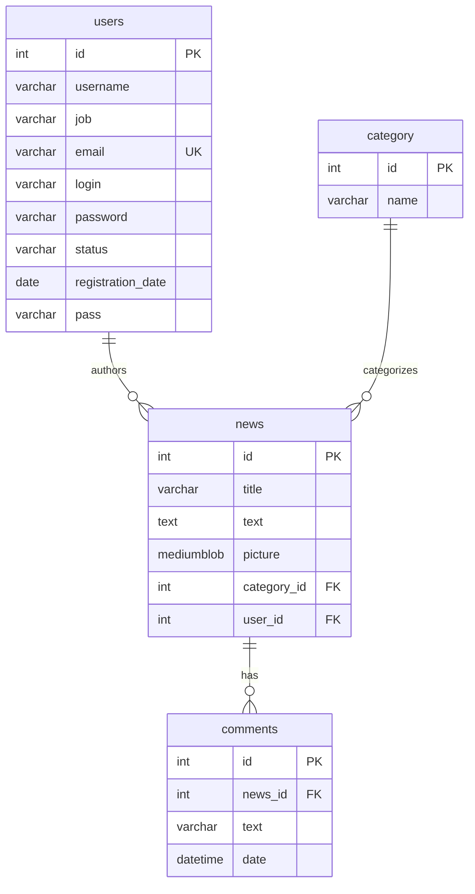

# Technical Specification (ТЗ) — News Portal (PHP MVC)

**Project Name:** NewsPortal  
**Version:** 1.0.0  
**Architecture:** Model-View-Controller (MVC)  
**Technology Stack:** PHP 8+, MySQL (InnoDB), Apache (XAMPP), HTML5, CSS3, JavaScript, Bootstrap 5  

---

## Table of Contents
1. [Project Overview](#1-project-overview)
2. [Goals and Objectives](#2-goals-and-objectives)
3. [User Roles and Permissions](#3-user-roles-and-permissions)
4. [Functional Requirements](#4-functional-requirements)
   - [4.1. Public Website Module](#41-public-website-module)
   - [4.2. Commenting System Module](#42-commenting-system-module)
   - [4.3. User Authentication & Registration Module](#43-user-authentication--registration-module)
   - [4.4. Administration Dashboard](#44-administration-dashboard)
   - [4.5. Admin News Management Module (CRUD)](#45-admin-news-management-module-crud)
   - [4.6. Admin Category Management Module (CRUD)](#46-admin-category-management-module-crud)
   - [4.7. Admin Profile Management](#47-admin-profile-management)
5. [Database Architecture & Schema](#5-database-architecture--schema)
6. [System Architecture & Routing Table](#6-system-architecture--routing-table)
7. [Non-Functional & Security Requirements](#7-non-functional--security-requirements)
8. [Acceptance Criteria & Testing Plan](#8-acceptance-criteria--testing-plan)

---

## 1. Project Overview

**NewsPortal** is a dynamic, database-driven web application for publishing, categorizing, reading, and commenting on news articles. The project includes:
* A public-facing web portal for visitors and registered members.
* A secure, feature-rich administration control panel (`admin/`) for content editors and administrators.
* Implementation of the **MVC (Model-View-Controller)** software pattern to decouple database business logic, request routing/controllers, and presentation templates.

---

## 2. Goals and Objectives

1. **Information Delivery:** Provide users with categorized news feeds, detailed full-article reading pages, and the latest top stories.
2. **User Engagement:** Enable registered users and visitors to participate in discussions by leaving comments on published articles.
3. **Content Lifecycle Management:** Provide administrators with full CRUD capabilities (Create, Read, Update, Delete) for news articles and news categories.
4. **Security & Integrity:** Ensure secure authentication with password hashing (`password_hash`), parameterized SQL queries to prevent SQL injections, and cascading data protection.

---

## 3. User Roles and Permissions

| Role | Access Level | Permissions |
|------|--------------|-------------|
| **Guest / Visitor** | Public Portal | Browse top/all news, filter by category, view article details, read comments, view registration & login forms. |
| **Registered User (`status = 'user'`)** | Public Portal | All guest permissions + post comments to news articles, session-based user profile status. |
| **Administrator (`status = 'admin'`)** | Public Portal + Admin Panel (`admin/`) | Full system control: Manage news (CRUD), manage categories (CRUD), view dashboard analytics, change admin credentials, delete comments. |

---

## 4. Functional Requirements

### 4.1. Public Website Module
* **FR-1.1 (Home Page):** Must display the **3 latest published news articles** (`ORDER BY news.id DESC LIMIT 3`) with thumbnail images, titles, short previews, and category badges.
* **FR-1.2 (All News Catalog):** Must display a paginated/full list of all published articles with total article count.
* **FR-1.3 (Category Filtering):** Users can filter articles by clicking on category links in the navigation bar or the sidebar widget.
* **FR-1.4 (Single Article Detail View):** Must render full article text, high-resolution image (BLOB data URI), author name, category, and publication date.
* **FR-1.5 (Error Handling):** Invalid or non-existent article/category IDs must return a clean **HTTP 404 Not Found** error page.

### 4.2. Commenting System Module
* **FR-2.1 (Comment Submission):** Users can submit comments via a dedicated form located below each news article.
* **FR-2.2 (Comment Storage):** Comments are linked to the corresponding article via `news_id`, storing comment text and current timestamp.
* **FR-2.3 (Comment Counters):** The number of comments must be displayed on article cards in list views and at the top of the comments section.
* **FR-2.4 (Comment Display):** Comments are ordered chronologically (`DESC`) displaying text and creation date.

### 4.3. User Authentication & Registration Module
* **FR-3.1 (Registration Form):** Requires `Name`, `E-mail`, `Password`, and `Password Confirmation`.
* **FR-3.2 (Registration Validation):**
  * Email must be valid format and unique in the database.
  * Password must be at least 6 characters long and match confirmation.
  * Newly registered accounts are automatically assigned role `status = 'user'`.
  * Passwords must be hashed using `PASSWORD_DEFAULT` (bcrypt).
* **FR-3.3 (Public User Login):** Accessible via `index.php?action=login`. Validates credentials against `users` table and initializes session (`userId`, `name`, `email`, `status`).
* **FR-3.4 (User Logout):** Destroys active session and redirects with a feedback notification.

### 4.4. Administration Dashboard
* **FR-4.1 (Admin Authentication):** Independent login gateway at `admin/index.php`. Unauthorized attempts to access admin routes must redirect to the login form.
* **FR-4.2 (Analytics Cards):** Displays real-time counts for:
  * Total published news articles.
  * Total news categories.
  * Total user comments.
  * Total registered users.
* **FR-4.3 (Recent Activity Table):** Displays the last 5 published articles with quick-action buttons.

### 4.5. Admin News Management Module (CRUD)
* **FR-5.1 (News List):** Table showing ID, image thumbnail, title, category, author, and actions (View, Edit, Delete).
* **FR-5.2 (Add News):** Multipart form accepting title, category dropdown, text, and image file upload (JPEG/PNG). Stores image directly as MySQL `MEDIUMBLOB` or `LONGBLOB`.
* **FR-5.3 (View News Detail):** Dedicated internal admin view displaying full text, metadata, and high-res image.
* **FR-5.4 (Edit News):** Form pre-populated with existing data, allowing modification of title, category, text, and optional replacement of image.
* **FR-5.5 (Delete News with Confirmation):** 
  * Displays a dedicated confirmation page showing article preview and number of attached comments.
  * Executed only via `POST` request.
  * Automatically cascades deletion to remove all attached comments from `comments` table.

### 4.6. Admin Category Management Module (CRUD)
* **FR-6.1 (Category List):** Displays category IDs, names, and live article counters.
* **FR-6.2 (Add Category):** Form to create new category with uniqueness check.
* **FR-6.3 (Edit Category):** Form to rename an existing category.
* **FR-6.4 (Protected Category Deletion):** Deletion is blocked if the category contains one or more assigned news articles to prevent orphaned records.

### 4.7. Admin Profile Management
* **FR-7.1 (Profile Update):** Allows changing the administrator's display name and updating the account password securely.

---

## 5. Database Architecture & Schema

The relational database is named **`newsportal`** with character encoding `utf8mb4` / `utf8_estonian_ci`.

---

## 6. System Architecture & Routing Table

### 6.1. Public Routes (`index.php`)
| Route (`action`) | Method | Controller Action | Description |
|------------------|--------|-------------------|-------------|
| *default* / `start` | `GET` | `Controller::StartSite()` | Home page with Top 3 articles |
| `allnews` | `GET` | `Controller::AllNews()` | All articles catalog |
| `category&id=X` | `GET` | `Controller::NewsByCategory($id)` | Filter articles by category ID |
| `read&id=X` | `GET` | `Controller::ReadNews($id)` | Single article & comments view |
| `insertcomment&id=X` | `POST` | `Controller::InsertComment($id)` | Add comment to article |
| `login` | `GET` | `Controller::loginForm()` | Public user login page |
| `loginAction` | `POST` | `Controller::loginUser()` | Process user authentication |
| `logout` | `GET` | `Controller::logoutUser()` | Log out and destroy session |
| `registerForm` | `GET` | `Controller::registerForm()` | User registration form |
| `registerAnswer` | `POST` | `Controller::registerUser()` | Process registration & validation |

### 6.2. Admin Routes (`admin/index.php`)
| Route (`action`) | Method | Controller Action | Description |
|------------------|--------|-------------------|-------------|
| *default* / `start` | `GET` | `controllerAdmin::startAdmin()` | Dashboard analytics & recent posts |
| `login` | `GET`/`POST` | `controllerAdmin::loginAction()` | Admin login processing |
| `logout` | `GET` | `controllerAdmin::logoutAction()` | Admin logout |
| `newsAdmin` / `news` | `GET` | `controllerAdminNews::newsList()` | News management table |
| `newsDetail&id=X` | `GET` | `controllerAdminNews::newsDetail($id)` | Single news detail preview |
| `newsAdd` | `GET` | `controllerAdminNews::newsAddForm()` | Add news form |
| `newsAddSave` | `POST` | `controllerAdminNews::newsAddSave()` | Save new article to DB |
| `newsEdit&id=X` | `GET` | `controllerAdminNews::newsEditForm($id)` | Edit news form |
| `newsEditSave&id=X` | `POST` | `controllerAdminNews::newsEditSave($id)` | Save updated article |
| `newsDeleteForm&id=X`| `GET` | `controllerAdminNews::newsDeleteForm($id)`| Delete confirmation screen |
| `newsDelete&id=X` | `POST` | `controllerAdminNews::newsDelete($id)` | Execute news & comments deletion |
| `categoryAdmin` | `GET` | `controllerAdminCategory::categoryList()` | Category management list |
| `categoryAdd` | `GET` | `controllerAdminCategory::categoryAddForm()` | Add category form |
| `categoryAddSave` | `POST` | `controllerAdminCategory::categoryAddSave()` | Save new category |
| `categoryEdit&id=X` | `GET` | `controllerAdminCategory::categoryEditForm($id)` | Edit category form |
| `categoryEditSave&id=X`| `POST` | `controllerAdminCategory::categoryEditSave($id)` | Save updated category |
| `categoryDelete&id=X` | `GET` | `controllerAdminCategory::categoryDelete($id)` | Delete category (if empty) |
| `profile` | `GET` | `controllerAdmin::profileForm()` | Admin account settings |
| `profileSave` | `POST` | `controllerAdmin::profileSave()` | Update name & password |

---

## 7. Non-Functional & Security Requirements

1. **SQL Injection Prevention:** All database operations utilize PDO with prepared statements and parameter binding (`:name`, `:id`, `:email`).
2. **Cross-Site Scripting (XSS) Prevention:** All dynamic outputs rendered in HTML templates are sanitized using `htmlspecialchars()`.
3. **Password Security:** Passwords stored in database are hashed with `password_hash($pass, PASSWORD_DEFAULT)`.
4. **Session Integrity:** Sessions are managed securely using native PHP sessions (`session_start()`), validating active user ID and session identifiers on protected routes.
5. **Responsive Layout:** Compatible with desktop, tablet, and mobile displays using Bootstrap 5 fluid grid system.
6. **Error Resiliency:** Clean 404 handling prevents fatal unhandled errors and redirects users smoothly back to navigation.

---

## 8. Acceptance Criteria & Testing Plan

| ID | Test Scenario | Expected Result | Status |
|----|---------------|-----------------|--------|
| **TC-01** | Open home page (`index.php`) | Displays 3 newest articles, category sidebar, and navbar | **PASSED** |
| **TC-02** | Submit comment on article | Comment saved in DB and rendered immediately in comments list | **PASSED** |
| **TC-03** | Register user with existing email | Validation error: *"Пользователь с таким E-mail уже зарегистрирован"* | **PASSED** |
| **TC-04** | Register user with mismatched passwords | Validation error: *"Введенные пароли не совпадают"* | **PASSED** |
| **TC-05** | Public login with user credentials | User authenticated, badge displayed, stays on public site | **PASSED** |
| **TC-06** | Admin access to `admin/index.php` | Prompts login if unauthenticated; opens dashboard when authenticated | **PASSED** |
| **TC-07** | Create news article with BLOB image | News inserted, image renders correctly as Base64 Data URI | **PASSED** |
| **TC-08** | Edit existing news article | Changes reflected immediately in DB and front-end | **PASSED** |
| **TC-09** | Delete news with attached comments | Confirmation form shown; post deletion removes article + comments | **PASSED** |
| **TC-10** | Delete non-empty category | Deletion blocked with protective warning message | **PASSED** |
